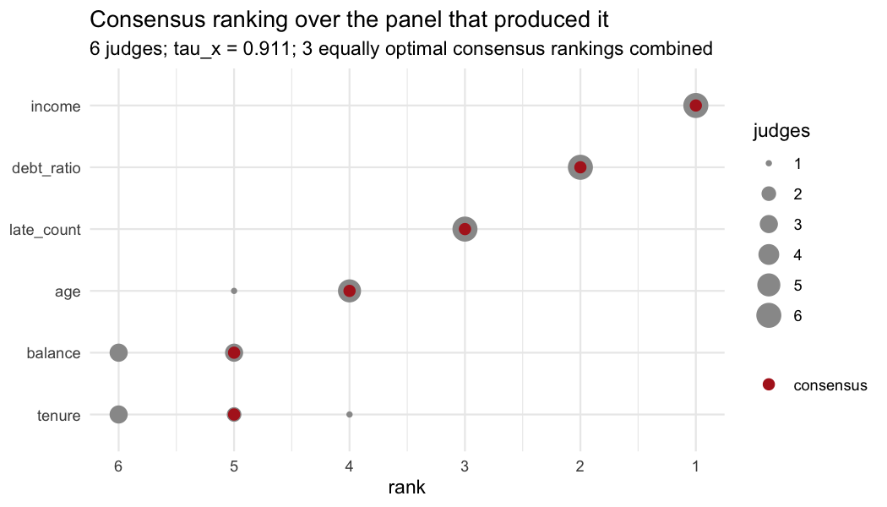
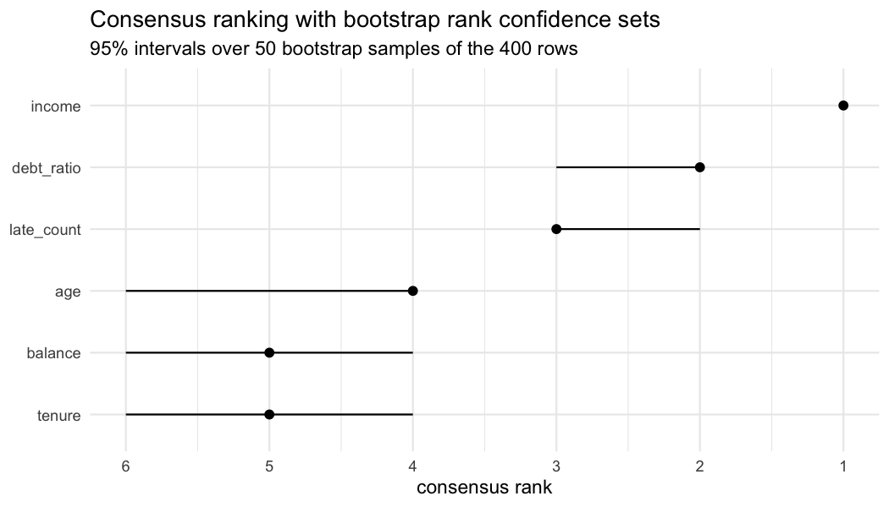

<!-- README.md is generated from README.Rmd. Please edit that file. -->

# rankimp

<!-- badges: start -->

[](https://github.com/agostinognasso/rankimp/actions/workflows/R-CMD-check.yaml)
[](https://github.com/agostinognasso/rankimp/actions/workflows/test-coverage.yaml)
[](https://lifecycle.r-lib.org/articles/stages.html#experimental)
<!-- badges: end -->

Consensus ranking of variable importance, with the uncertainty attached.

`rankimp` treats every combination of importance method, model, random
seed and resample as a **judge** casting a ranking over the predictors.
It computes the Kemeny median of that panel, keeps the ties the panel
cannot break, and puts bootstrap confidence sets around the result so
that a claim about which variables matter can be falsified rather than
merely stated.

It builds on [`ConsRank`](https://cran.r-project.org/package=ConsRank)
for the consensus itself. The contribution is the inferential layer on
top.

## The problem

A variable importance ranking is an estimate. It comes from an estimator
with variance, computed on one sample, under one definition of
importance, and it is almost always reported as though it were a fact.

Three things move it, and they are separable.

The **definition** moves it. Mean decrease in impurity, permutation
importance, LOCO and SHAP are not noisy measurements of one underlying
quantity. They ask different questions, and on correlated predictors
they have different right answers. Permutation importance on a fitted
model asks what that model would lose. LOCO asks what a model built
without the variable would lose. Those diverge by construction.

The **estimator** moves it. Refit the same forest under a different seed
and the ordering changes, because the ensemble is random.

The **sample** moves it. Refit on another draw from the same population
and the ordering changes again. This is the one a reader cares about
when they ask whether the finding is real.

Reporting a single ranking from a single method on a single fit
collapses all three into one number and prints it with no error bar.

## What the package does instead

Every source of importance becomes a judge, the panel is aggregated into
a Kemeny median, and the median is bootstrapped. The whole package is
one line of work, and each stage is usable on its own.

    importance scores       importance_permutation()   importance_mdi()
          |                 importance_loco()          importance_shap()
          v
       rankings             importance_to_rank()
          |
          v
       a panel              importance_judges()   <- builds all of the above
          |
          +--> weights      judge_weights()
          v
      a consensus           consensus_rank()
          |
          +--> per judge    item_consensus()
          +--> subgroups    judge_clusters()
          v
      uncertainty           rank_confsets()
          |
          +--> probability  prob_topk()
          +--> a decision   rank_select()

If you already have a matrix of rankings from somewhere else, start at
`consensus_rank()` and ignore the top half.

## Installation

Not on CRAN yet. Install from GitHub:

``` r
# install.packages("pak")
pak::pak("agostinognasso/rankimp")
```

## A worked example, end to end

The whole package on one problem, with the truth known in advance so
that every answer can be checked.

### The data, and what is true in it

Six predictors. Three of them drive the outcome and three are noise, and
one of the three that matter is a small count rather than a continuous
variable, which is the case impurity importance handles badly.

``` r
library(rankimp)

set.seed(2024)
n <- 400
credit <- data.frame(
  income     = rnorm(n),      # signal
  debt_ratio = rnorm(n),      # signal
  late_count = rpois(n, 1),   # signal, and a small count
  age        = rnorm(n),      # noise
  balance    = rnorm(n),      # noise
  tenure     = rnorm(n)       # noise
)
credit$risk <- with(credit,
  1.2 * income - 1.0 * debt_ratio + 0.9 * late_count + rnorm(n)
)

set.seed(1)
fit <- randomForest::randomForest(risk ~ ., data = credit, ntree = 300)
```

The true ordering of the three signal variables is `income`,
`debt_ratio`, `late_count`. The other three have no ordering at all,
because they have no effect.

### One ranking, and no error bar

This is the standard report: fit a model, ask it once, print what it
said.

``` r
set.seed(1)
round(importance_permutation(fit, credit, "risk", n_perm = 5), 3)
#>     income debt_ratio late_count        age    balance     tenure 
#>      1.153      0.848      0.804      0.173      0.182      0.172

round(importance_mdi(fit), 1)
#>     income debt_ratio late_count        age    balance     tenure 
#>      567.9      404.9      282.5      115.4      110.8      116.9
```

Both are right about the top three and both invent an ordering for the
bottom three, and nothing in either output says which part is which.

### Why ranks and not scores

The two vectors above are not on a common scale, and no rescaling puts
them on one, because they answer different questions. A permutation loss
of 1.15 and an impurity decrease of 568 cannot be averaged.

Ranks are the coarsest thing every method can be made to agree to
produce. `importance_to_rank()` converts scores to ranks, and gives
equal scores equal ranks instead of separating them by column order.

``` r
scores <- rbind(
  permutation = { set.seed(1); importance_permutation(fit, credit, "risk", n_perm = 5) },
  mdi         = importance_mdi(fit)
)
importance_to_rank(scores)
#>             income debt_ratio late_count age balance tenure
#> permutation      1          2          3   5       4      6
#> mdi              1          2          3   5       6      4
```

The price of working in ranks is that a disagreement living entirely in
the magnitudes becomes invisible. The panel keeps the scores as well, in
`attr(J, "scores")`, and `vignette("method-disagreement")` works through
a case where two methods differ by a factor of six in the scores and
produce the same ordering.

### A panel instead of a ranking

`importance_judges()` builds the panel. It runs the requested backends
over every combination of four axes, methods, models, seeds and
resamples, and returns a `judges` object: an integer matrix with one row
per judge, plus the provenance and the raw scores.

``` r
J <- importance_judges(
  fit,
  methods = c("permutation", "mdi"),
  data    = credit,
  target  = "risk",
  seeds   = 1:3,
  n_perm  = 5
)
J
#> <judges> 6 judges x 6 variables
#>   models  : model1 
#>   methods : permutation, mdi 
#>   seeds   : 1, 2, 3 
#>   weights : none (equal) 
#>   recipe  : kept; rank_confsets(type = "data") can rebuild this panel
#> 
#>                       income debt_ratio late_count age balance tenure
#> model1:permutation:s1      1          2          3   4       5      6
#> model1:mdi:s1              1          2          3   5       6      4
#> model1:permutation:s2      1          2          3   4       5      6
#> model1:mdi:s2              1          2          3   4       6      5
#> model1:permutation:s3      1          2          3   4       5      6
#> model1:mdi:s3              1          2          3   4       6      5
```

Two methods times three seeds is six judges, and each seed costs a
refit. The three permutation judges agree exactly. The impurity judges
do not agree with them about the bottom three, and one of them,
`mdi:s1`, does not even agree about `age`.

The seed-1 judges are worth a second look. Refitting under seed 1
reproduces the forest fitted above, and `mdi:s1` therefore repeats the
impurity ranking exactly. `permutation:s1` does not repeat the
permutation ranking above: it puts `age` fourth where the ad hoc run put
`balance` there. Permutation importance is itself a random estimator,
and five shuffles are nowhere near enough to order three variables whose
true importance is zero. Nothing was misconfigured; that is the size of
the noise.

Every axis multiplies. `seeds` measures the ensemble's own noise,
`fit_list` takes several fitted models when you want a consensus that
holds across learners, and `resamples` takes an `rset` from rsample,
refitting on each analysis set and scoring on the assessment set, so
that the judges are out of sample.

Provenance is kept, one row per judge:

``` r
attr(J, "provenance")
#> # A tibble: 6 × 6
#>   judge                 model  engine       method       seed resample
#>   <chr>                 <chr>  <chr>        <chr>       <int> <chr>   
#> 1 model1:permutation:s1 model1 randomForest permutation     1 <NA>    
#> 2 model1:mdi:s1         model1 randomForest mdi             1 <NA>    
#> 3 model1:permutation:s2 model1 randomForest permutation     2 <NA>    
#> 4 model1:mdi:s2         model1 randomForest mdi             2 <NA>    
#> 5 model1:permutation:s3 model1 randomForest permutation     3 <NA>    
#> 6 model1:mdi:s3         model1 randomForest mdi             3 <NA>
```

### The consensus

`consensus_rank()` returns the ranking with the smallest total
Kemeny-Snell distance to all the judges.

``` r
cr <- consensus_rank(J)
cr
#> <consensus_rank>
#>   judges    : 6  
#>   variables : 6 
#>   algorithm : BB (ties allowed) 
#>   tau_x     : 0.9111 
#>   note      : 3 equally optimal consensus rankings; combined, so variables they order differently are tied
#> 
#> # A tibble: 6 × 2
#>   variable    rank
#>   <chr>      <int>
#> 1 income         1
#> 2 debt_ratio     2
#> 3 late_count     3
#> 4 age            4
#> 5 balance        5
#> 6 tenure         5
```

The panel recovers the true ordering of the three signal variables, and
it declines to order `balance` against `tenure`. That tie is the point.
It appears because the Kemeny median here is not unique: three rankings
attain the same minimum, and they disagree about exactly that pair.

``` r
cr$consensus_all
#>      income debt_ratio late_count age balance tenure
#> [1,]      1          2          3   4       5      6
#> [2,]      1          2          3   4       5      5
#> [3,]      1          2          3   4       6      5
```

Reporting the first of those three would not be neutral, because which
one comes first depends on the order of your columns. The package
averages each variable's position over the whole optimal set and
re-ranks with ties, and keeps the full set available.

`tau_x` is the mean Emond-Mason agreement between the consensus and the
judges. Read it as how much agreement there was to summarise. It is not
a p-value and not a goodness of fit.

``` r
library(ggplot2)
autoplot(cr)
```



The grey points are every rank the judges actually gave, with point area
showing how many judges sat there. The spread is per variable, which is
what `tau_x` cannot tell you: the top three are unanimous and the bottom
three are not.

### Who disagrees, and by how much

`item_consensus()` scores each judge against the reported consensus,
worst first.

``` r
item_consensus(cr)
#> # A tibble: 6 × 3
#>   judge                 weight tau_x
#>   <chr>                  <dbl> <dbl>
#> 1 model1:mdi:s1              1 0.8  
#> 2 model1:mdi:s2              1 0.933
#> 3 model1:mdi:s3              1 0.933
#> 4 model1:permutation:s1      1 0.933
#> 5 model1:permutation:s2      1 0.933
#> 6 model1:permutation:s3      1 0.933
```

`judge_weights()` turns that into votes. `by = "method"` lets you hand
impurity half a vote because you do not trust it here;
`by = "reliability"` gives each judge a weight that grows with its
agreement with the rest of the panel.

``` r
round(judge_weights(J, by = "reliability"), 3)
#> model1:permutation:s1         model1:mdi:s1 model1:permutation:s2 
#>                 1.009                 0.953                 1.009 
#>         model1:mdi:s2 model1:permutation:s3         model1:mdi:s3 
#>                 1.009                 1.009                 1.009
```

Reliability weighting sharpens the consensus around the majority, which
is a choice to make deliberately rather than by default. It makes a lone
dissenter quieter, and sometimes the lone dissenter is the one that is
right.

### One panel, or two panels stuck together

When agreement is low, the question is whether the disagreement is
spread evenly or whether the panel has a seam in it. `judge_clusters()`
looks for the seam by k-medians in Kemeny-Snell space, where each
group's centre is the Kemeny median of its own members and is therefore
a ranking you can report.

``` r
judge_clusters(J)
#> <judge_clusters>
#>   judges    : 6  
#>   variables : 6 
#>   clusters  : 2 (silhouette 0.75, p = 0.04 against one population) 
#>   start     : enumerated medoids 
#> 
#> # A tibble: 6 × 3
#>   judge                 cluster silhouette
#>   <chr>                   <int>      <dbl>
#> 1 model1:permutation:s1       1        1  
#> 2 model1:permutation:s2       1        1  
#> 3 model1:permutation:s3       1        1  
#> 4 model1:mdi:s1               2        0.5
#> 5 model1:mdi:s2               2        0.5
#> 6 model1:mdi:s3               2        0.5
#> 
#> Group consensus:
#>           income debt_ratio late_count age balance tenure
#> cluster_1      1          2          3   4       5      6
#> cluster_2      1          2          3   4       6      5
```

The seam falls exactly along the method axis, permutation against
impurity, and the test rejects a single population at `p = 0.04`.
Reading the two group consensuses is what makes the finding usable: they
differ only in the order of `balance` and `tenure`, which are the two
variables with no effect. The panel does divide, and it divides over
nothing that matters.

The hard part of this function is not finding groups, it is refusing to
find them. Silhouette width on its own splits a homogeneous panel of six
judges 62% of the time, because judges that rank alike sit at distance
zero and score a perfect silhouette. So the observed panel's best
division in two is compared against reference panels drawn from a single
population, and `k` comes back as 1 unless that comparison rejects.

### How much of this survives another sample

`rank_confsets()` puts an interval around each variable's rank. There
are two bootstraps and they answer different questions.

`type = "judges"` resamples the panel. It measures how much the
consensus depends on which sources of importance happened to be in it,
and it refits nothing, so it is cheap.

``` r
set.seed(7)
rank_confsets(cr, n_boot = 500)
#> <rank_confsets>
#>   replicates : 500 ( quick )
#>   level      : 0.95 
#>   resampled  : 6 judges, with replacement 
#> 
#> # A tibble: 6 × 4
#>   variable    rank lower upper
#>   <chr>      <int> <int> <int>
#> 1 income         1     1     1
#> 2 debt_ratio     2     2     2
#> 3 late_count     3     3     3
#> 4 age            4     4     4
#> 5 balance        5     5     6
#> 6 tenure         5     4     6
```

`type = "data"` resamples the rows, refits every model and rebuilds the
whole panel, once per replicate. It measures whether the ordering would
survive another dataset, which is usually the question a reader actually
has. It needs a panel built by `importance_judges()`, because it needs
the recipe to rebuild.

``` r
set.seed(7)
cb <- rank_confsets(cr, type = "data")
#> Data bootstrap: 50 replicates at about 0.96 s each, roughly 48 seconds.
cb
#> <rank_confsets>
#>   replicates : 50 ( quick )
#>   level      : 0.95 
#>   resampled  : 400 rows, with replacement; the panel is rebuilt on each 
#> 
#> # A tibble: 6 × 4
#>   variable    rank lower upper
#>   <chr>      <int> <int> <int>
#> 1 income         1     1     1
#> 2 debt_ratio     2     2     3
#> 3 late_count     3     2     3
#> 4 age            4     4     6
#> 5 balance        5     4     6
#> 6 tenure         5     4     6
```

The two disagree, and the disagreement is the lesson. Resampling the
judges says `debt_ratio` is certainly second and `late_count` certainly
third. Resampling the data says the sample does not order that pair at
all, and that the three noise variables are somewhere in the bottom half
with no ordering among them.

This gap is not particular to the example. Measured over 300 replicates
per cell, a nominal 95% set from the data bootstrap covered between
0.966 and 0.998; the judge bootstrap covered between 0.582 and 0.929 and
reached the nominal level in none of the six cells. Resampling a panel
measures how much the methods argue with each other, which is a real
quantity and a much smaller one than sampling variability.

``` r
autoplot(cb)
```



Overlapping intervals are the honest way of saying two variables cannot
be ordered on this evidence.

### From an interval to a decision

`prob_topk()` reports how often each variable landed in the top `k`
across the replicates.

``` r
prob_topk(cb, k = 4)
#> # A tibble: 6 × 2
#>   variable   probability
#>   <chr>            <dbl>
#> 1 debt_ratio        1   
#> 2 income            1   
#> 3 late_count        1   
#> 4 age               0.56
#> 5 tenure            0.32
#> 6 balance           0.2
```

Three variables the data will not keep out of the top four, and three
that split the fourth slot between them. `age` takes it more often than
the other two and still not often enough to be claimed. These
probabilities are conservative in the middle of their range and accurate
at the ends: a variable reported at 0.44 is really in the top `k` about
56% of the time, and one reported at 0.98 is there 98% of the time. They
understate rather than overstate, which is the direction to want.

`rank_select()` keeps the variables whose entire interval clears a
threshold. This is the function to reach for when someone is going to
act on the answer.

``` r
rank_select(cb, threshold = 3)
#> [1] "income"     "debt_ratio" "late_count"
rank_select(cb, threshold = 5)
#> [1] "income"     "debt_ratio" "late_count"
```

It returns the three signal variables and nothing else, and loosening
the threshold from 3 to 5 does not buy a fourth. That is the intended
behaviour: the rule is deliberately conservative, and the calibration
study says at most 3% of its selections are undeserved, and none at all
at the thresholds that make the strongest claim, while it selects
between a third and a half of the variables that did deserve selection.

Read a short list as "these I can defend", not as "these are the ones
that matter". If it returns nothing, that is an answer.

### What the example showed

The panel recovered the true ordering of the signal, refused to order
the noise, found the seam between the two importance methods, reported
that the seam was about nothing that matters, and selected exactly the
three variables that deserved selection. None of those five statements
can be made from a single ranking produced by a single method on a
single fit.

## The theory underneath

`vignette("theory")` is the full argument. The short version:

**The consensus is a Kemeny median.** Given `K` judges each ranking the
same `p` variables,

$$\pi^{*} = \arg\min_{\pi} \sum_{k=1}^{K} w_k \, d_{KS}(\pi, \pi_k)$$

where $d_{KS}$ is the Kemeny-Snell distance, which counts pairwise
disagreements and charges half for a pair one ranking ties and the other
does not. The reason to use this and not an average of ranks is that
Kemeny and Snell showed it is the only distance satisfying a short list
of requirements a rank aggregation ought to meet, and the median that
comes from it is a Condorcet method: if a majority of judges put A above
B, so does the consensus whenever that is consistent. An average of
ranks gives no such guarantee, because an outlier's distance enters it
linearly.

**Ties are part of the answer.** The optimisation is over weak
orderings, that is rankings allowed to tie. Two variables that half the
panel orders one way and half the other have no defensible ordering, and
a procedure that returns one anyway has invented it.

**The median is often not unique**, arising in 57% to 98% of replicates
in the simulation study, so the package combines the whole optimal set
rather than taking whichever the solver returned first.

**Finding it is NP-hard.** The package solves exactly by branch and
bound up to ten variables and switches to heuristics above that. The
threshold is empirical: on tied panels of thirty judges the same exact
solver took 0.010 seconds at ten variables, 0.78 at eleven and 280 at
twelve. Importance panels are the hard case for these solvers, because
the unimportant variables all tie near zero.

**Agreement is measured by Emond-Mason $\tau_x$**, not Kendall's
$\tau_b$. $\tau_b$ normalises ties in a way that breaks the
correspondence with the Kemeny distance, so maximising it and minimising
$d_{KS}$ stop being the same problem. $\tau_x$ restores it, which makes
the consensus and the agreement statistic two views of one optimisation
rather than two numbers that sit near each other.

**A rank is a discrete, non-smooth functional of the data.** There is no
delta method for a quantity that jumps by a whole unit when two nearly
equal scores swap places, which is why the intervals are bootstrapped,
and why which bootstrap you ran has to be stated rather than assumed.

**The intervals are wide, and that is the finding rather than a
defect.** On the hardest simulated cell the interval spans 5.1 of 8
available ranks, and on that same cell the point estimate recovers the
exact order of the signal variables 5.3% of the time. A narrower
interval would be claiming more than the data hold.

## Every exported function

| The question you are asking | The function |
|----|----|
| How important does this one method say each variable is? | `importance_permutation()`, `importance_mdi()`, `importance_loco()`, `importance_shap()` |
| I have scores; give me a ranking with honest ties | `importance_to_rank()` |
| Build me a panel from fitted models, across methods, seeds, folds, models | `importance_judges()` |
| Some judges deserve less of a vote than others | `judge_weights()` |
| What ordering do the judges agree on? | `consensus_rank()` |
| Which judges disagree with that consensus? | `item_consensus()` |
| Is this one panel, or two panels stuck together? | `judge_clusters()` |
| How much of this ordering would survive another sample? | `rank_confsets()` |
| What is the chance this variable really belongs in the top five? | `prob_topk()` |
| Which variables can I defend putting in a report? | `rank_select()` |
| Show me the panel, the intervals, the groups | `autoplot()` |

Supported engines are randomForest and ranger. Adding a third means
extending `R/engines.R` and nothing else; adding a definition of
importance means one backend in `R/judges-methods.R` and one entry in
the `methods` argument.

## What has been measured

Every number quoted in this README and in the documentation comes from a
script in `inst/simulations/`, and those are meant to be re-run rather
than believed.

| Claim | Measured |
|----|----|
| The data bootstrap covers at its nominal level | 0.966 to 0.998 over 300 replicates per cell |
| The judge bootstrap does not | 0.582 to 0.929, nominal reached in none of six cells |
| `prob_topk()` understates rather than overstates | 0.44 reported against 56% actual; 0.98 against 98% |
| `rank_select()` is conservative | at most 3% undeserved selections, and none at the strongest thresholds |
| `judge_clusters()` refuses fake groups | silhouette alone splits one population 62% of the time; the calibrated test does not |
| Testing two groups beats testing the best `k` | power 0.633 to 0.917 against 0.233 falling to 0.067 as judges are added |

## What this does not protect you from

Every judge in a panel of tree-ensemble methods is a tree-ensemble
method. Averaging over methods, seeds, folds and two forest
implementations measures how much the answer depends on those choices. A
bias that all the judges share passes through the consensus untouched
and comes out looking like agreement.

The example above is deliberately mild about this: `late_count` is a
small count and impurity importance is biased against it, and the panel
caught the problem only because it contained a method that does not
share the bias. `vignette("credit-scoring")` shows the same mechanism
doing real damage. Had every judge been an impurity judge, the consensus
would have been narrow, confident and wrong in the same direction
throughout.

The backends also score on the data you hand them, so they are in-sample
unless you pass a holdout set or build the panel over `resamples`.
In-sample importance rewards variables the model overfit on.

Widen the panel along the axis you are worried about. A confidence set
is only as honest as the panel it summarises.

## Documentation

Start with whichever question you have.

| Vignette | What it covers |
|----|----|
| `vignette("rankimp-intro")` | the short tour: panels, the consensus, ties, weights |
| `vignette("reference")` | every function, what it returns, and when you want it |
| `vignette("theory")` | why a Kemeny median, and what a bootstrapped rank estimates |
| `vignette("stability")` | rank confidence sets and what they were measured to cover |
| `vignette("method-disagreement")` | panels that split, and reading one that does not |
| `vignette("credit-scoring")` | all four axes end to end on one problem |
| `vignette("against-set-stability")` | how this differs from `stabm` |

## Status

Early development, and complete end to end.

| Phase | Content | State |
|----|----|----|
| F1 | `importance_judges()`, backends, weights | done |
| F2 | Consensus, ties, algorithm selection | done |
| F3 | Bootstrap, rank confidence sets, `prob_topk()`, `rank_select()` | done |
| F4 | Judge clustering, plots, vignettes | done |
| F5 | CRAN, methodological paper | not started |

The inferential layer came first on purpose. `consensus_rank()`
orchestrates `ConsRank`; `rank_confsets()` orchestrates nothing, and it
is the part that lets a claim about variable importance be falsified.

## Related work

- [`ConsRank`](https://cran.r-project.org/package=ConsRank): the Kemeny
  median engine this package orchestrates.
- [`stabm`](https://cran.r-project.org/package=stabm): stability of
  selected *sets*, which is a different question from the stability of
  an *ordering*. See `vignette("against-set-stability")`.
- [`e2tree`](https://cran.r-project.org/package=e2tree): explains a
  forest with a single tree.
- `Proximum`: how the forest represents the data whose variables are
  ranked here.

## References

- Kemeny, J. G. and Snell, J. L. (1962). *Mathematical Models in the
  Social Sciences*. Ginn.
- Emond, E. J. and Mason, D. W. (2002). A new rank correlation
  coefficient with application to the consensus ranking problem.
  *Journal of Multi-Criteria Decision Analysis*, 11(1), 17-28.
- Amodio, S., D'Ambrosio, A. and Siciliano, R. (2016). Accurate
  algorithms for identifying the median ranking when dealing with weak
  and partial rankings under the Kemeny axiomatic approach. *European
  Journal of Operational Research*, 249(2).

## License

MIT, see `LICENSE`.
