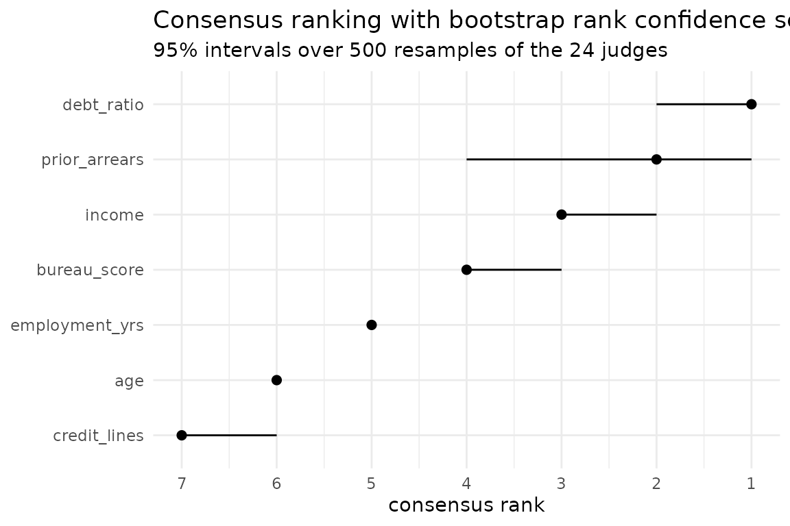

# Robustly important variables in credit scoring

A lender must be able to say which characteristics drive a decision, and
must be able to defend the claim. “Our random forest’s permutation
importance ranked income first” does not survive the obvious follow-up:
*would a different method, or a different seed, or a different fold,
have said the same?*

This vignette answers that question end to end, using judges drawn along
all four axes at once, which are method, seed, fold and model family,
and it ends up refusing to answer part of it, which is the point.

## The portfolio

Synthetic, so that the right answer is known. Default risk rises with
arrears and debt, falls with income and with time in work; age and the
number of credit lines do nothing at all.

``` r

set.seed(7)
n <- 800
loans <- data.frame(
  income         = round(rlnorm(n, log(38000), 0.45)),
  debt_ratio     = round(pmin(rbeta(n, 2, 5) * 1.6, 1), 3),
  age            = round(rnorm(n, 44, 12)),
  employment_yrs = round(pmax(rexp(n, 1 / 7), 0), 1),
  credit_lines   = rpois(n, 4),
  prior_arrears  = rpois(n, 1.1)
)
risk <- -3.7 +
  3.2 * loans$debt_ratio +
  0.85 * loans$prior_arrears -
  0.75 * scale(log(loans$income))[, 1] -
  0.20 * scale(loans$employment_yrs)[, 1]
loans$default <- factor(
  ifelse(rbinom(n, 1, plogis(risk)) == 1, "yes", "no"), levels = c("no", "yes")
)

mean(loans$default == "yes")
#> [1] 0.2375
```

Each coefficient times the spread of its own variable gives the effect
that a ranking ought to recover: `prior_arrears` 0.88, `debt_ratio`
0.80, `income` 0.75, `employment_yrs` 0.20, and zero for the other two.
The first three are close enough together that no honest procedure
should claim to order them.

## The panel

Two model families, two methods, three folds, two seeds: 24 judges.

``` r

library(rankimp)
library(randomForest)
#> randomForest 4.7-1.2
#> Type rfNews() to see new features/changes/bug fixes.
library(ranger)
#> 
#> Attaching package: 'ranger'
#> The following object is masked from 'package:randomForest':
#> 
#>     importance

set.seed(1)
rf_fit <- randomForest(default ~ ., data = loans, ntree = 300)
set.seed(1)
rgr_fit <- ranger(default ~ ., data = loans, num.trees = 300,
                  importance = "impurity", probability = TRUE)

J <- importance_judges(
  fit_list  = list(rf = rf_fit, ranger = rgr_fit),
  methods   = c("permutation", "mdi"),
  data      = loans,
  target    = "default",
  resamples = rsample::vfold_cv(loans, v = 3),
  seeds     = 1:2
)
J
#> <judges> 24 judges x 6 variables
#>   models  : rf, ranger 
#>   methods : permutation, mdi 
#>   seeds   : 1, 2 
#>   resamples: Fold1, Fold2, Fold3 
#>   weights : none (equal) 
#>   recipe  : kept; rank_confsets(type = "data") can rebuild this panel
#> 
#>                         income debt_ratio age employment_yrs credit_lines
#> rf:permutation:s1:Fold1      2          3   6              4            5
#> rf:mdi:s1:Fold1              2          1   5              4            6
#> rf:permutation:s1:Fold2      1          3   4              5            6
#> rf:mdi:s1:Fold2              1          2   5              4            6
#> rf:permutation:s1:Fold3      3          2   4              6            5
#> rf:mdi:s1:Fold3              2          1   5              3            6
#> rf:permutation:s2:Fold1      2          3   6              5            4
#> rf:mdi:s2:Fold1              2          1   5              4            6
#> rf:permutation:s2:Fold2      3          2   4              5            6
#> rf:mdi:s2:Fold2              1          2   5              4            6
#>                         prior_arrears
#> rf:permutation:s1:Fold1             1
#> rf:mdi:s1:Fold1                     3
#> rf:permutation:s1:Fold2             2
#> rf:mdi:s1:Fold2                     3
#> rf:permutation:s1:Fold3             1
#> rf:mdi:s1:Fold3                     4
#> rf:permutation:s2:Fold1             1
#> rf:mdi:s2:Fold1                     3
#> rf:permutation:s2:Fold2             1
#> rf:mdi:s2:Fold2                     3
#> ... and 14 more judges
```

Any one of those 24 rows, reported alone, would look like a result.

## What the panel agrees on

``` r

cr <- consensus_rank(J)
cr
#> <consensus_rank>
#>   judges    : 24  
#>   variables : 6 
#>   algorithm : BB (ties allowed) 
#>   tau_x     : 0.7111 
#> 
#> # A tibble: 6 × 2
#>   variable        rank
#>   <chr>          <int>
#> 1 prior_arrears      1
#> 2 debt_ratio         2
#> 3 income             3
#> 4 employment_yrs     4
#> 5 age                5
#> 6 credit_lines       6
```

The consensus recovers the true ordering exactly. It would be a mistake
to stop here: `tau_x` of 0.72 says the judges are a long way from
unanimous, and the ordering they were averaged into does not carry that.

## What survives resampling

``` r

cb <- rank_confsets(cr, n_boot = 500)
cb
#> <rank_confsets>
#>   replicates : 500 ( quick )
#>   level      : 0.95 
#>   resampled  : 24 judges, with replacement 
#> 
#> # A tibble: 6 × 4
#>   variable        rank lower upper
#>   <chr>          <int> <int> <int>
#> 1 prior_arrears      1     1     3
#> 2 debt_ratio         2     1     3
#> 3 income             3     1     3
#> 4 employment_yrs     4     4     4
#> 5 age                5     5     5
#> 6 credit_lines       6     6     6
```

The top three variables each have the interval `[1, 3]`. The consensus
puts them in the right order and the data cannot support it.

``` r

rank_select(cb, threshold = 2)
#> character(0)
rank_select(cb, threshold = 3)
#> [1] "prior_arrears" "debt_ratio"    "income"
```

The first call returns nothing at all. There is no variable this
portfolio can place in the top two, and a report claiming “arrears and
debt are the two drivers” would be making up the part that matters. The
second call returns all three: *“these three characteristics drive
default, ahead of everything else”* is defensible, and any statement
that orders them is not.

That is the whole argument for the package in three lines of output. A
point estimate answers a question it was never entitled to answer.

``` r

autoplot(cb)
```



## Where the disagreement lives

A panel of 24 that disagrees is worth taking apart before it is
averaged.

``` r

het <- judge_clusters(J)
het$k
#> [1] 2
```

Two groups. The useful question is which axis they fall along, and the
panel records the provenance of every judge:

``` r

provenance <- attr(J, "provenance")
table(method = provenance$method, cluster = het$cluster)
#>              cluster
#> method         1  2
#>   mdi         10  2
#>   permutation  4  8
table(model = provenance$model, cluster = het$cluster)
#>         cluster
#> model    1 2
#>   ranger 6 6
#>   rf     8 4
```

The seam is the **method**, not the model family: MDI judges sit almost
entirely in one group, permutation judges mostly in the other, while
randomForest and ranger judges are spread evenly across both. Swapping
the engine changes little; swapping how importance is defined changes
the answer.

``` r

het$centres
#>           income debt_ratio age employment_yrs credit_lines prior_arrears
#> cluster_1      2          1   5              4            6             3
#> cluster_2      2          3   6              5            4             1
```

MDI puts `debt_ratio` first and `prior_arrears` third; permutation
reverses them. `debt_ratio` is continuous and `prior_arrears` is a small
count, and mean decrease in impurity is known to favour variables with
more places to split. The panel has rediscovered that bias, and
[`judge_clusters()`](../reference/judge_clusters.md) located it without
being told to look.

This is the cross-family robustness check worth reporting: a variable
ranked highly by both engines and both methods is substantively
important; one that ranks highly only under MDI is telling you about the
estimator.

## What a consensus cannot do for you

Every judge here is a tree ensemble. Averaging over methods, seeds,
folds and two forest implementations measures how much the answer
depends on those choices, and nothing else. A bias that all 24 judges
share, because they are all built from trees, passes through the
consensus untouched and comes out looking like agreement.

The split above is the reason to believe that is not an abstract worry:
the cardinality bias was visible only because the panel contained a
method that does not share it. Widen the panel along the axis you are
worried about, or the narrow confidence set you get back is measuring
the wrong thing.
