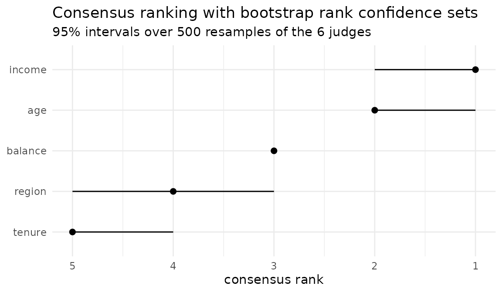

# How stable is a variable importance ranking?

Two sources of instability, and they are not the same thing.

**Intrinsic.** Refit the same model on the same data with a different
seed and the ranking moves. This is variability of the *estimator*, and
multi-replicate judges measure it.

**Data.** Refit on a different fold or bootstrap sample and the ranking
moves again. This is variability of the *estimand*, and multi-fold
judges measure it.

A ranking that survives the first but not the second is telling you the
sample is too small to support the claim, not that the model is
unstable.

[`rank_confsets()`](../reference/rank_confsets.md) reaches both, and
says which one it is measuring. `type = "judges"` resamples the panel
you already have: whatever variability you built into it, whether seeds,
folds or methods, is what the intervals reflect. `type = "data"` goes
back to the data instead, drawing the rows with replacement and
rebuilding the panel from scratch on every draw. The first is nearly
free; the second costs a refit of every model per replicate.

## A panel that does not quite agree

``` r

library(rankimp)

judges <- rbind(
  permutation_seed1 = c(1, 2, 3, 4, 5),
  permutation_seed2 = c(1, 2, 3, 5, 4),
  permutation_seed3 = c(2, 1, 3, 4, 5),
  shap              = c(1, 3, 2, 4, 5),
  impurity          = c(1, 2, 4, 3, 5),
  loco              = c(2, 1, 3, 5, 4)
)
colnames(judges) <- c("income", "age", "balance", "region", "tenure")

cr <- consensus_rank(judges)
cr
#> <consensus_rank>
#>   judges    : 6  
#>   variables : 5 
#>   algorithm : BB (ties allowed) 
#>   tau_x     : 0.8 
#> 
#> # A tibble: 5 × 2
#>   variable  rank
#>   <chr>    <int>
#> 1 income       1
#> 2 age          2
#> 3 balance      3
#> 4 region       4
#> 5 tenure       5
```

`tau_x` summarises the agreement. Whether that summary is a fair one is
a separate question, and
[`item_consensus()`](../reference/item_consensus.md) answers it by
scoring every judge against the consensus:

``` r

item_consensus(cr)
#> # A tibble: 6 × 3
#>   judge             weight tau_x
#>   <chr>              <dbl> <dbl>
#> 1 loco                   1   0.6
#> 2 impurity               1   0.8
#> 3 permutation_seed2      1   0.8
#> 4 permutation_seed3      1   0.8
#> 5 shap                   1   0.8
#> 6 permutation_seed1      1   1
```

A single judge far below the rest is a finding, not noise. Marginal and
conditional importance measures diverge by construction when predictors
are correlated, and the one in the minority will look like an outlier.

## Rank confidence sets

``` r

set.seed(1)
cb <- rank_confsets(cr, n_boot = 500)
cb
#> <rank_confsets>
#>   replicates : 500 ( quick )
#>   level      : 0.95 
#>   resampled  : 6 judges, with replacement 
#> 
#> # A tibble: 5 × 4
#>   variable  rank lower upper
#>   <chr>    <int> <int> <int>
#> 1 income       1     1     2
#> 2 age          2     1     2
#> 3 balance      3     3     3
#> 4 region       4     3     5
#> 5 tenure       5     4     5
```

Each variable sits at its consensus rank, with the interval of ranks it
plausibly occupies when the panel is resampled. Overlapping intervals
mean the two variables cannot be ordered on this evidence, which is the
statement most importance plots decline to make.

``` r

autoplot(cb)
```



## Probability of membership in the top k

``` r

prob_topk(cb, k = 2)
#> # A tibble: 5 × 2
#>   variable probability
#>   <chr>          <dbl>
#> 1 income          1   
#> 2 age             0.99
#> 3 balance         0.01
#> 4 region          0   
#> 5 tenure          0
```

“`income` is the most important variable” is a claim that cannot be
falsified. “`income` is in the top two with the probability printed
above” can be.

## Selection with a guarantee

``` r

rank_select(cb, threshold = 3)
#> [1] "income"  "age"     "balance"
```

A variable is selected only when its whole confidence set clears the
threshold. Selecting on the point estimate would ignore that the ranking
was estimated in the first place. The rule is conservative on purpose:
it answers “which variables am I sure about”, and
[`prob_topk()`](../reference/prob_topk.md) quantifies the doubt about
the rest.

## Resampling the data instead of the panel

Everything above resamples the panel. To ask the other question the
models have to be refitted, and `type = "data"` does exactly that: each
replicate draws the rows with replacement, refits every model,
recomputes every judge and takes the consensus again. It needs a panel
built by [`importance_judges()`](../reference/importance_judges.md),
which keeps the recipe: the fits, the data, the settings, so that none
of it has to be handed over twice.

The two questions can disagree, and thin data is where they do. Eight
predictors, five of them real with deliberately close effects, three
pure noise, and eighty rows:

``` r

set.seed(7)
n <- 80
sim <- as.data.frame(matrix(rnorm(n * 8), n, 8))
names(sim) <- paste0("x", 1:8)
sim$y <- 2 * sim$x1 + 0.60 * sim$x2 + 0.55 * sim$x3 +
  0.50 * sim$x4 + 0.45 * sim$x5 + rnorm(n, sd = 1)

set.seed(1)
forest <- randomForest::randomForest(y ~ ., data = sim, ntree = 200)

set.seed(2)
sim_panel <- importance_judges(forest, methods = c("permutation", "mdi"),
                               data = sim, target = "y", seeds = 1:3)
cr_sim <- consensus_rank(sim_panel)
cr_sim
#> <consensus_rank>
#>   judges    : 6  
#>   variables : 8 
#>   algorithm : BB (ties allowed) 
#>   tau_x     : 0.8571 
#>   note      : 3 equally optimal consensus rankings; combined, so variables they order differently are tied
#> 
#> # A tibble: 8 × 2
#>   variable  rank
#>   <chr>    <int>
#> 1 x1           1
#> 2 x2           2
#> 3 x3           3
#> 4 x5           4
#> 5 x4           5
#> 6 x6           5
#> 7 x8           7
#> 8 x7           8
```

Six judges, two methods on three refits, and a consensus that reads like
a clean ordering. Now put an interval around it twice:

``` r

set.seed(3)
by_judges <- rank_confsets(cr_sim, n_boot = 500)

set.seed(3)
by_data <- rank_confsets(cr_sim, type = "data")

by_data
#> <rank_confsets>
#>   replicates : 50 ( quick )
#>   level      : 0.95 
#>   resampled  : 80 rows, with replacement; the panel is rebuilt on each 
#> 
#> # A tibble: 8 × 4
#>   variable  rank lower upper
#>   <chr>    <int> <int> <int>
#> 1 x1           1     1     1
#> 2 x2           2     2     8
#> 3 x3           3     2     7
#> 4 x5           4     2     8
#> 5 x4           5     3     7
#> 6 x6           5     2     7
#> 7 x8           7     3     8
#> 8 x7           8     4     8
```

Read the table before reading on: some intervals do not contain the
consensus rank they sit beside. That is the method, not a fault. Eighty
rows drawn with replacement hold about fifty distinct ones, and a
weak-but-real predictor is harder to place on that much less
information, so its bootstrap ranks drift towards worse positions. Give
a replicate all eighty distinct rows instead and it returns the point
estimate exactly, which is how bootstrap bias is told apart from a panel
rebuilt wrongly.

Then ask each the same question, which variables would you certify in
the top three, and compare the answers:

``` r

rank_select(by_judges, threshold = 3)
#> [1] "x1" "x2"
rank_select(by_data, threshold = 3)
#> [1] "x1"
```

Where the two lists differ, the difference is the sample talking. A
variable the panel agrees on but the data will not support is exactly
the case the opening paragraphs describe: not an unstable model, a
sample too small for the claim.

Two things to know about how a data replicate is built. A `resamples`
axis is replaced by the bootstrap’s own in-bag/out-of-bag split, so a
panel of `models x methods x V` judges is rebuilt with
`models x methods` of them and each replicate votes with fewer judges
than the point estimate did. And refits preserve the number of trees and
`mtry` and nothing else, so a forest with a hand-tuned `nodesize` comes
back at the engine’s default. That is true of the `seeds` and
`resamples` axes too.

## How much is a 95% set worth?

It depends entirely on which bootstrap you asked for, and the package
would rather say so than let you assume otherwise.
`inst/simulations/rank-coverage.R` measures it: eight predictors, five
of them real, 300 simulated datasets per cell, and a check of how often
the nominal 95% set contains the rank the generating coefficients imply.

For the signal variables, resampling the **data** covered

- 0.966, 0.969 and 0.978 at `n` of 80, 200 and 500 when the effects are
  close enough that the middle of the ranking is barely identifiable;
- 0.993 and 0.998 at `n` of 80 and 200 when they separate cleanly.

Resampling the **judges** covered 0.582, 0.655 and 0.711 on those close
cells, and 0.801 and 0.929 on the separated ones.

So the data bootstrap covers, at or above its nominal level everywhere
it was measured, and the judge bootstrap covers nowhere. That gap, 0.966
against 0.582 in the hardest cell, is the reason `type = "data"` exists.

It is worth being clear about *how* the data bootstrap covers, because
it is not by being sharp. On the hardest cell its interval spans 5.1 of
the 8 available ranks. That is the honest report: at `n = 80` with
effects that close, the point estimate recovers the true order of the
five signal variables in 5% of replicates, so an interval that admitted
less would be claiming more than the data holds. Width here is
information, not failure.

The judge bootstrap is narrow on the same cell, 2.0 ranks, and misses
the true rank two times in five. Resampling a panel measures how much
the methods disagree with each other, which is not how far the ranking
would move on another sample. It answers a different question cheaply,
and [`judge_clusters()`](../reference/judge_clusters.md) is the right
tool for that question.

Read a rank confidence set as a statement about what the evidence rules
out. The rank is a discrete, non-smooth functional, and a percentile
bootstrap is not automatically valid for such things: the figures above
are measured on these designs, not promised in general.

## A note on cost

Every bootstrap replicate solves a Kemeny problem, which is NP-hard.
Exact branch-and-bound is fast on panels that agree and pathological on
panels that do not: on tied panels of thirty judges, one exact solve
took 0.010 s with ten variables, 0.78 s with eleven, and 280 s with
twelve. That last figure is a day and a half for five hundred
replicates.

[`rank_confsets()`](../reference/rank_confsets.md) therefore resamples
with the `"quick"` heuristic by default and reports which solver it
used. On twenty tied panels of ten variables, `"quick"` returned the
identical consensus and the identical `tau_x` as exact branch-and-bound.
Pass `algorithm = "exact"` if you want the guarantee inside the
bootstrap and the panel is small enough to afford it.

A data replicate adds a refit of every model to that solve, which is why
`n_boot` defaults to 50 there against 500 for the panel bootstrap, and
why a run that looks long announces its projected cost before settling
in.

## Related work

[`vignette("against-set-stability")`](../articles/against-set-stability.md)
compares this machinery with
[`stabm`](https://cran.r-project.org/package=stabm), which measures
whether resamples select the same features rather than whether they
order them the same way. The two answer different questions and a
careful analysis wants both.
